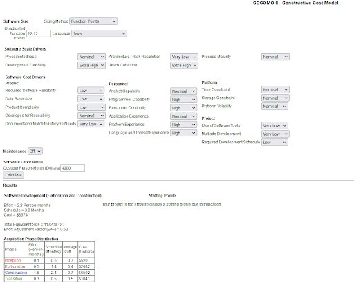

# **Project Management Plan**

# **Go Fish**

**Version 1.0 draft 1**

**Prepared by**  **Chandler Fletcher and Alexander Hannen**

**CS492**

**January 24, 2022**

**Table of Contents**

### [**1. Overview**](#1)

[1.1. Project Purpose, Objectives, and Success Criteria](#1.1)

[1.2. Project Deliverables](#1.2)

[1.3. Assumptions, Dependencies, and Constraints](#1.3)

[1.4. References](#1.4)

[1.5. Definitions and Acronyms](#1.5)

[1.6. Evolution of the Plan](#1.6)

### [**2. Project Organization**](#2)

[2.1. External Interfaces](#.1)

[2.2. Internal Structure](#2.2)

[2.3. Roles and Responsibilities](#2.3)

### [**3. Managerial Process Plans**](#3)

[3.1. Start-Up Plans 2](#3.1)

[3.1.1 Estimation Plan](#3.1.1)

[3.1.2 Staffing Plan](#3.1.2)

[3.1.3 Staff Training Plan](#3.1.3)

[3.1.4 Resource Acquisition Plan](#3.1.4)

[3.1.5 Project Commitments](#3.1.5)

[3.2. Work Plan](#3.2)

[3.3 Control Plan](#3.3)

[3.3.1 Data Control Plan](#3.3.1)

[3.3.2 Requirements Control Plan](#3.3.2)

[3.3.3 Schedule Control Plan](#3.3.3)

[3.3.4 Budget Control Plan](#3.3.4)

[3.3.5 Communication, Tracking, and Reporting Plan](#3.3.5)

[3.3.6 Metrics Collection Plan](#3.3.6)

[3.4. Risk Management Plan](#3.4)

[3.5. Issue Resolution Plan](#3.5)

[3.6. Project Close-Out Plan](#3.6)

### [**4. Technical Process Plans**](#4)

[4.1. Process Model](#4.1)

[4.2. Methods, Tools, and Techniques](#4.2)

[4.3. Configuration Management Plan](#4.3)

[4.4. Quality Assurance Plan](#4.4)

[4.5. Documentation Plan](#4.5)

[4.6. Process Improvement Plan](#4.6)

# <a name = "1">**1. Overview**

</a>

This project will convert the Go Fish card game into a software version.. The required 
resources for developing this project are Java and an IDE that can run the Java Swing library. 
This project must be done by May 05, 2022. This project currently has no budget  
as specified in section 3.3.4.

| **Milestone** | **Description** | **Date** |
| --- | --- | --- |
|**Phase 1: Project Management Plan** | **CS492**| 02/20/2022|
|**Phase 2: Implementation #1** | **CS492** | **03/20/2022** |
| Phase 2.5: Implementation #2 | CS492| 04/09/2022 |
| Phase 3: Testing | CS492 | 05/02/2022|

## <a name = "1.1">**1.1. Project Purpose, Objectives, and Success Criteria**

</a>

The objective of this project is to provide a Go Fish card game in an application.  
Stakeholders involved in this project can judge the project based on if needs  
were met and the application is satisfactory.

<a name = "1.2">

## **1.2. Project Deliverables**

</a>

| **Deliverable** | **Recipients** | **Delivery Date** | **Delivery Method** | **Comments** |
| --- | --- | --- | --- | --- |
| SRS Document | CS491 | 12/06/21 | Western Online | N/A |
| Go Fish | CS492 | 05/02/22 | Western Online | N/A |

## <a name = "1.3">**1.3. Assumptions, Dependencies, and Constraints**

</a>

- **AS-1**
  - The developers have all of the required skills to complete this project.
- **DE-2**
  - Java is required to complete this project
- **DE-3**
  - An IDE capable of running Java and using the Swing library is required
- **CO-4**
  - There will only be two developers working on this project
- **CO-5**
  - The project must be completed within the deadline.

## <a name = "1.4"> **1.4. References**

</a>

https://en.wikipedia.org/wiki/Go\_Fish

## <a name = "1.5"> **1.5. and Acronyms**

</a>

Go Fish - A card game that can be usually played by two to four players.

AS - Assumptions

DE - Dependency

CO - Constraints

## <a name = "1.6"> **1.6. Evolution of the Plan**

</a>

This project management plan will be updated after every milestone specified in 1.3  
of this Project Management Plan is completed if needed. If any future revisions are  
made to this project management plan, then it will be stated on the revision  
history at the end of this document.

# <a name = "2"> **2. Project Organization**

</a>

This section will list those involved in this project and how they are involved.  
It will also describe the structure and roles of each party involved and how  
communication will be held between those involved.

## <a name = "2.1"> **2.1. External Interfaces**

</a>

Communication between the parties involved in this project, the ones working on  
this project, and the one overseeing this project will happen via google mail or  
google hangout at undefined times. There will also be various face-to-face  
communications at undefined times

## <a name = "2.2">**2.2. Internal Structure**

</a>

The parties working on this project, Alex Hannen and Chandler Fletcher, will be  
equal in terms of authority, responsibility, and position in this project.

## <a name = "2.3">**2.3. Roles and Responsibilities**

</a>

- Student 1 - Alex Hannen
- Student 2 - Chandler Fletcher

Current project stakeholders include Professor Russel Glaue. The stakeholder role 
in this project will be to judge the current state of the project after each milestone.  
The schedule of these will be conjoint with the schedule of each milestone completion  
listed in section 1 of this document.

# <a name = "3">**3. Managerial Process Plans**

</a>

This section will provide information on different plans that include the project and staff.

## <a name = "3.1">**3.1. Start-Up Plans**

</a>

We first created a Software Requirements Specification (SRS) document to help  
determine what this project will require. Use Cases, class diagrams, sequence  
diagrams will also be created to help with this process. These diagrams can be  
found in the SRS diagram. After completion of these tasks, the project will move  
into the development phase which is more explained through the gantt charts.

### <a name = "3.1.1">**3.1.1. Estimation Plan**

</a>

To better understand the resources, project size, effort, cost and scheduling and  
any other requirements that our project would be subjected to, we decided to use  
the Function Point Estimation tool to help us better understand how taxing this  
project would be.. We also incorporated the Constructive Cost Model (COCOMO) to  
better understand the effort and schedule that would be required of us.

### <a name = "3.1.2">**3.1.2. Staffing Plan**

</a>

Per section 2.3, current staff will only include Alex Hannen and Chandler Fletcher.  
Each Staff will be needed for 8 months for this project. Both staff will be required  
to have some basic programming knowledge. Assignments and candidates selected for  
said assignments will be decided at the date the assignments are announced to the  
discretion of both staffs.

### <a name = "3.1.3">**3.1.3. Staff Training Plan**

</a>

If any staff involved in the project do not have any programming experience, then  
they will be required to gain some basic programming knowledge on their own time.  
No other training will be required.

### <a name = "3.1.4">**3.1.4. Resource Acquisition Plan**

</a>

Two computers capable of running task intensive resources will be required.  
Computers will be required to have JAVA and an IDE that is capable of using the  
Swing library. Internet Connection will also be required for communication efforts.  
Staff listed in Section 2.3 will be required to bring their own resources. Any  
resources that can not be acquired by the staff own means can be resolved by going  
to the Computer Lab in STIPES hall.

### <a name = "3.1.5">**3.1.5. Project Commitments**

</a>

| **Commitment** | **Made By** | **Made To** | **Due Date** | **Comments** |
| --- | --- | --- | --- | --- |
| SRS Document | Hannen,Fletcher | CS491 | 12/06/2021 | N/A |
| Use Case Diagram | Hannen,Fletcher | CS491 | 12/06/2021 | N/A |
| Activity Diagram | Hannen,Fletcher | CS491 | 12/06/2021 | N/A |
| Sequence Diagram | Hannen,Fletcher | CS491 | 12/06/2021 | N/A |
| Class Diagram | Hannen,Fletcher | CS491 | 12/06/2021 | N/A |
| Project Management Plan | Hannen,Fletcher | CS492 | 02/20/2022 | N/A |
| Gantt Chart | Hannen,Fletcher | CS492 | 02/20/2022 | N/A |

## <a name = "3.2">**3.2. Work Plan**

</a>

A more detailed work plan can be seen on the project gantt chart. For the entirety  
of the project, there will be a fixed amount of staff as specified in Section 2.3.  
Resources required are detailed in Section 3.1.4 and are unlikely to change. The  
entire duration of this project is estimated to be about 8 month. As specified in  
Section 3.3.4, there is no budget for this project and that is unlikely to change.

## <a name = "3.3">**3.3. Control Plan**

</a>

This document and the control plans below should be reassessed and updated with  
each weekly meeting for the project.

### <a name = "3.3.1">**3.3.1. Data Control Plan**

</a>

**Github Link:**

[https://github.com/cf-eli/go-fish](https://github.com/cf-eli/go-fish)

The project will be Managed using Git and uploaded to GitHub in a shared repository.

- Project files will be managed within this repository.
- Project plans and management documentation will be included in this repository.

### <a name = "3.3.2">**3.3.2. Requirements Control Plan**

</a>

Requirements will be evaluated on each team meeting and a decision will be made  
if the team is meeting the requirements for each phase of the project. If a  
requirement is changed and needs to be conveyed immediately, the discord group  
should be notified asap.

### <a name = "3.3.3">**3.3.3. Schedule Control Plan**

</a>

**Gantt chart link:**

[https://prod.teamgantt.com/gantt/schedule/?ids=2980548#&amp;ids=2980548&amp; user=&amp;custom=&amp;company=&amp;hide\_completed=false&amp;date\_filter=&amp;color\_filter=](https://prod.teamgantt.com/gantt/schedule/?ids=2980548#&amp;ids=2980548&amp;user=&amp;custom=&amp;company=&amp;hide_completed=false&amp;date_filter=&amp;color_filter=)

The project will be using a gantt chart to track and monitor the progress of the 
software. If progress falls behind on  scheduled time restraints, schedules will 
be reevaluated and updated promptly with a notification to the group discord.

### <a name = "3.3.4">**3.3.4. Budget Control Plan**

</a>

There is currently no budget to be monitored for Go Fish.

### <a name = "3.3.5">**3.3.5. Communication, Tracking, and Reporting Plan**

</a>

Communication between members will primarily be through the weekly team meetings,  
and interpersonally thorough discord. If sufficient changes need to be made that  
need to be discussed immediately , they should be communicated with thoughts and  
notes through that channel.

| **Type of Communication** | **Communication Schedule** | **Typical Communication Mechanism** | **Who Initiates** | **Recipient** |
| --- | --- | --- | --- | --- |
| Status Report | every Friday | team meeting | scheduled | everyone |
| Schedule and Effort Tracking Report | weekly | discord | Hannen | Fletcher |
| Project Review | monthly | During team meeting | scheduled | everyone |
| Risk Mitigation Status | as mitigation actions are completed | discord | responsible team member | everyone |
| Requirement Changes | as changes are approved | discord/email and change control tool | Hannen | affected Project Participants |

### <a name = "3.3.6">**3.3.6. Metrics Collection Plan**

</a>

Metrics should be collected with Netbeans IDE and stored in the proper location  
in the project folder

## <a name = "3.4">**3.4. Risk Management Plan**

</a>

Risk will be assessed and managed as needed, with discord as a medium for  
communication on which risk mitigation actions have been completed.

## <a name = "3.5">**3.5. Issue Resolution Plan**

</a>

Issues should be identified and reported in the discord so that we may address them together.

## <a name = "3.6">**3.6. Project Close-Out Plan**

</a>

Go Fish should be completed and ready to be presented before the final presentation  
date (5-2-22) The repository for the project will remain available on github, for future reference if needed.

# <a name = "4">**4. Technical Process Plans**

</a>

## <a name = "4.1">**4.1.Process Model**

</a>

Go Fish will use an Agile development process model.

## <a name = "4.2">**4.2. Methods, Tools, and Techniques**

</a>

Java will be used as the programming language, with a preference for Netbeans as  
an IDE. Git will be used as a version control system, which should be paired with  
github as the host of the repository. Swing will be used to auto generate the framework  
of the GUI. Testing will be performed with Junit.

## <a name = "4.3">**4.3. Configuration Management Plan**

</a>

Schedule changes made to the gantt schedule should go through both parties and be  
approved before changes should be made, as well as changes to this PMP document  
and SRS. All other factors do not need to follow this plan.

## <a name = "4.4"**4.4. Quality Assurance Plan**

</a>

QA will be managed by Hannen, and the whole team will be responsible for working 
through the tasks presented. There will be specific time allotted leading up to  
the completion of the project.

## <a name = "4.5">**4.5. Documentation Plan**

</a>

Readme.md will be used to provide installation/running instructions to the end user.

Srs document will be used to provide detailed specifications of the software
 PMP will be used to provide the basis for the management of the project.

| **Document** | **Template or Standard** | **Created By** | **Reviewed By** | **Target Date** | **Distribution** |
| --- | --- | --- | --- | --- | --- |
| readme | Standard | Hannen | Fletcher | TBD | TBD |
| SRS | Template | Fletcher | Hannen | 2-21 | TBD |
| PMP | Template | Fletcher | Hannen | 2-21 | TBD |

## <a name = "4.6">**4.6 Process Improvement Plan**

</a>

**BASELINE** - Improvements will be made to the systems once the original goal of such is met:

- Easy mode
- One Ai player
- Game working optimally

**STRETCH GOALS** - Stretch goals are of the nature that **should not** affect the  
baseline of the game. If they are added, they are extra features that are not needed  
for the game to function:

- Condensing game windows for easier game flow
- increased AI difficulty(normal/hard)
- More AI players at once

Stretch goals are to only be attempted once the baseline is deemed complete. Stretch goals  should be handled in a way that does not disrupt the baseline.

**Revision History**

| **Name** | **Date** | **Reason for Changes** | **Version** |
| --- | --- | --- | --- |
| Fletcher, Hannen | 2/21/22 | initial draft | 1.0 draft 1 |

**Copyright © 2007 by Karl E. Wiegers. Permission is granted to use, modify, and distribute this document**
